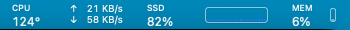
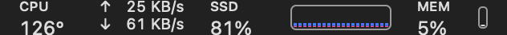
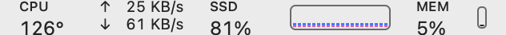
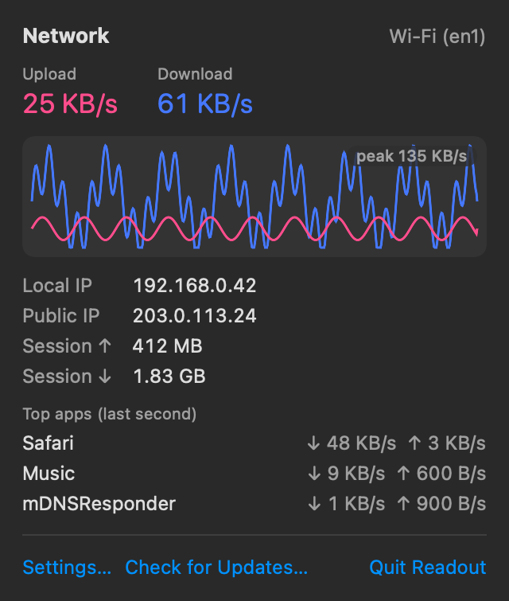
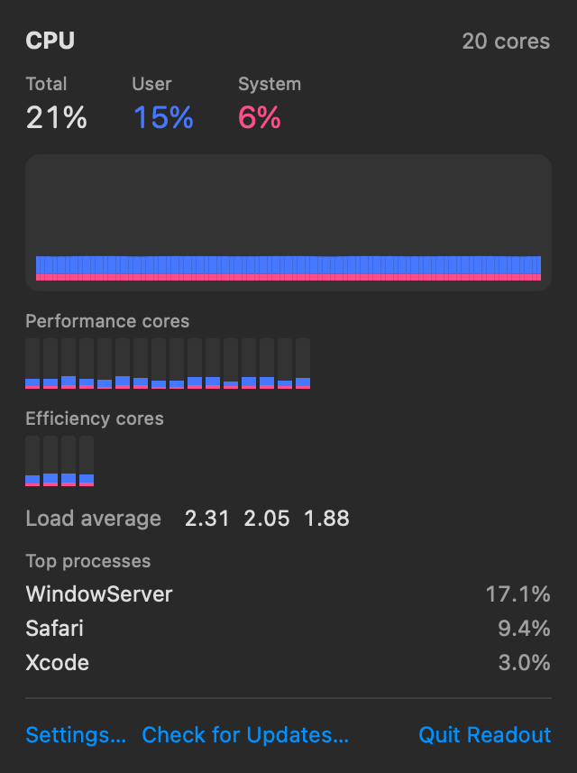
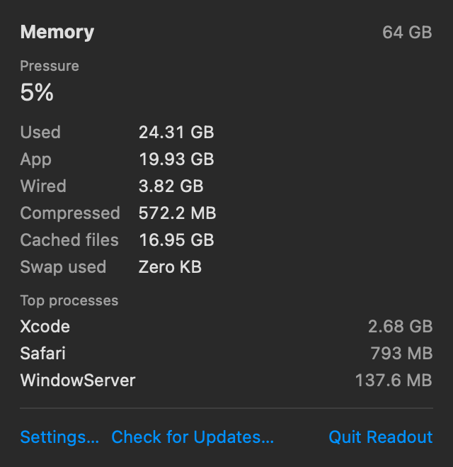
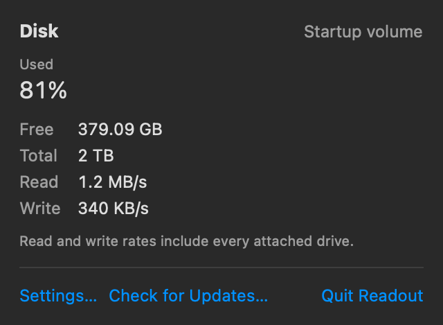
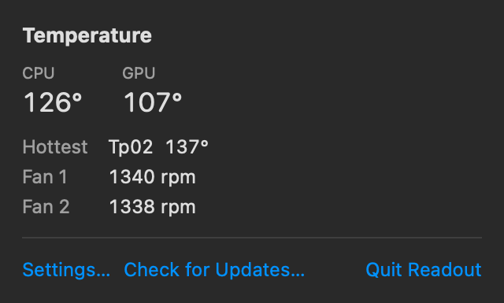

# Readout

A small, open-source macOS menu bar system monitor: network throughput first, plus CPU temperature, disk usage, CPU history and memory pressure.






| Network | CPU | Memory |
|---|---|---|
|  |  |  |

| Disk | Temperature |
|---|---|
|  |  |

## What it shows

- **Network**: upload and download rate of the primary interface, a 10-minute history, local and public IP, and the top apps by bandwidth.
- **CPU temperature**: the average of the CPU P-core sensors, plus GPU temperature, the hottest sensor and fan speed.
- **Disk**: startup volume usage (purgeable space counts as free) and read/write throughput.
- **CPU**: a user/system history graph, per-core load split into performance and efficiency cores, and the top processes.
- **Memory**: memory pressure, the used/wired/compressed breakdown, swap, and the top processes.

## Install

Download the latest `Readout-x.y.z.dmg` from [Releases](https://github.com/jeremywho/readout/releases), open it, and drag Readout to Applications. Requires macOS 26 or later. Builds are signed with Developer ID and notarized by Apple.

## Updates

Readout checks for updates once a day using [Sparkle](https://sparkle-project.org) and installs them automatically. You can turn this off in Settings, or use **Check for Updates…** in any panel. Updates are verified with an EdDSA signature and Apple's Developer ID signature.

## Privacy

Readout has no account, no analytics and no telemetry. It makes exactly two kinds of network request:

1. The daily update check, fetching `appcast.xml` from this repository's GitHub releases.
2. A public-IP lookup to `https://api.ipify.org`, made only while the network panel is open and cached for 5 minutes.

It reads sensor values from the SMC read-only, and never installs a helper or asks for administrator rights.

## Building from source

Requirements: Xcode 26, [XcodeGen](https://github.com/yonaskolb/XcodeGen).

```bash
swift test --package-path ReadoutKit
xcodegen generate
xcodebuild -project Readout.xcodeproj -scheme Readout -configuration Release -derivedDataPath build CODE_SIGN_IDENTITY=- build
open build/Build/Products/Release/Readout.app
```

`swift run --package-path ReadoutKit readout-probe` prints every metric once per second from the terminal.

## Releasing

CI runs on every push. To release, run the **Release** workflow from the Actions tab with a version such as `1.2.0`. It tests, signs, notarizes, publishes a dmg and zip, and updates the Sparkle appcast.

## License

MIT. See [LICENSE](LICENSE) and [THIRD_PARTY_NOTICES.md](THIRD_PARTY_NOTICES.md).
